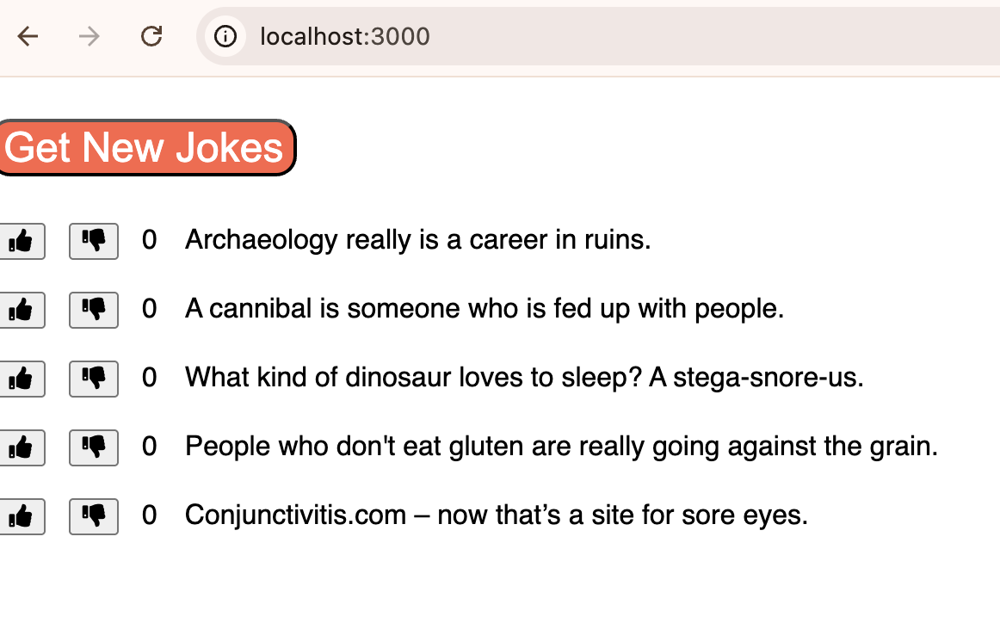

# CheeZJokes App 

A simple React app that displays cheesy dad jokes from the [icanhazdadjoke](https://icanhazdadjoke.com/api) API. Users can vote jokes up or down and fetch new jokes on demand.

---

## Features

- Fetches unique jokes from API on load
- Allows users to upvote/downvote each joke
- "Get New Jokes" button replaces all current jokes
- Loading spinner shown while fetching data
- Clean, responsive layout styled with CSS

---

## Tech Stack

- React (functional components + hooks)
- Axios for HTTP requests
- Font Awesome for icons
- CSS Modules / standard stylesheets

---

## Getting Started

1. **Install dependencies:**

```bash
npm install

```

2. **Run the app:**
```bash
npm start
```

3. **Open in browser:**
Open [http://localhost:3000](http://localhost:3000) to view it in the browser.
---
## Screenshots




FOLDER STRUCTURE

src/
├── App.js
├── JokeList.js
├── Joke.js
├── Spinner.js
├── JokeList.css


Credits
Jokes provided by icanhazdadjoke.com